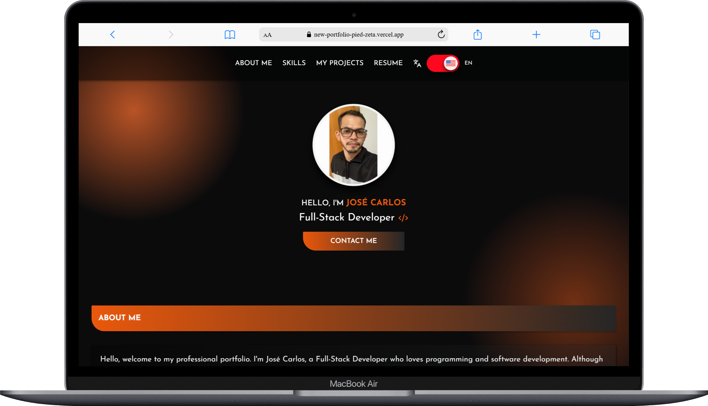
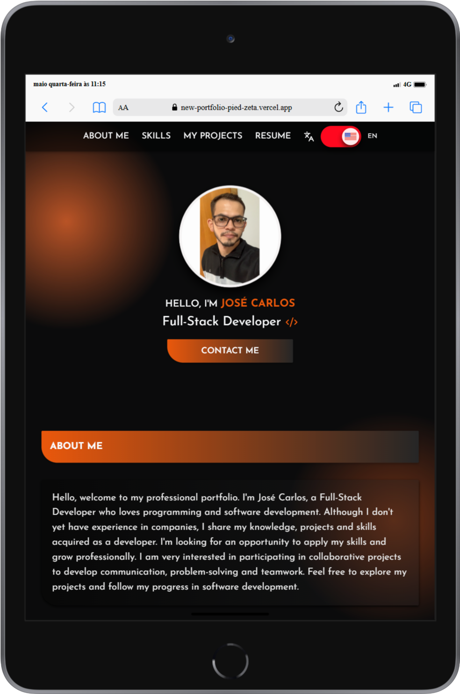

# Portfólio Pessoal - José Carlos

## Descrição
Este é meu portfólio pessoal desenvolvido com React e Vite, com o objetivo de apresentar minhas habilidades como desenvolvedor fullstack júnior. Através dele, você pode conhecer um pouco sobre mim, minhas competências técnicas e formas de contato.

## O que é esse Portfólio ?
É um site onde apresento meus projetos pessoais, ele conta com um botão para alternar entre os idiomas Português e Inglês. Nele, você encontrará informações sobre as empresas onde já trabalhei, minhas habilidades técnicas — incluindo Hard-Skills e Soft-Skills, minha formação acadêmica e um formulário integrado à API oficial do WhatsApp para facilitar o contato. Há também uma seção exclusiva para download do meu currículo, além de um resumo completo da minha trajetória profissional.

## Objetivos:
- Mostrar minhas habilidades técnicas com React, componentização, hooks, rotas, estilização com Tailwind CSS, e mais.
- Aplicar princípios de Clean Code, organização de pastas, e manutenção de estados com clareza.
- Ajudar iniciantes com códigos simples, legíveis e prontos para estudo.
- Apresentar meu estilo de trabalho para recrutadores e empresas de tecnologia.

## Funcionalidades
- [x] Este portfólio conta com um botão de alternância de idioma, permitindo uma excelente experiência tanto em Português (Brasil) quanto em Inglês.
- [x] Introdução pessoal e trajetória.
- [x] Sessão com habilidades técnicas Frontend, Backend e Banco de Dados.
- [x] Sessão com uma galeria de projetos com descrições breves e um botão de acesso que redireciona diretamente para o site de cada projeto.
- [x] Sessão para download do meu currículo, acompanhado de um breve resumo sobre minha trajetória profissional e objetivos na área de tecnologia. 
- [x] Sessão do formulário que permite enviar mensagens diretamente pelo WhatsApp com dados personalizados, utilizando a API oficial do WhatsApp.
- [x] Layout responsivo para Desktop, Tablet e Mobile.

## Tecnologias Utilizadas
- HTML: Linguagem de marcação para estruturação do conteúdo da web.
- CSS: Linguagem de estilo para o conteúdo da web.
- TailwindCSS: Framework utilitário para estilização rápida e responsiva.
- JavaScript (ES6+): Linguagem de programação utilizada para adicionar interatividade ao site.
- TypeScript: Foi criado um contexto de internacionalização (i18n) em React para gerenciar a troca de idioma e tradução dinâmica de textos entre português e inglês.
- Node.js: Ambiente de execução JavaScript do lado do servidor, utilizado para criar aplicações backend escaláveis e performáticas.
- React: Biblioteca JavaScript para construção de interfaces de usuário.​
- Vite: Ferramenta de build rápida e moderna para projetos front-end.
- Lucide: Biblioteca de ícones open-source baseada no Feather Icons, utilizada para adicionar ícones leves e personalizáveis à interface da aplicação.
- EmailJS – Serviço para envio de e-mails diretamente do frontend, utilizado no formulário de contato.

## 📸 Screenshots
<div align="center">
  <h3>Versão para Desktop</h3>
  
</div>
<br>

<div align="center">
  <h3>Versão para Tablet</h3>
  
</div>
<br>

<div align="center">
  <h3>Versão para Mobile</h3>
  
</div>

##  Como rodar o projeto localmente
## Clone o repositório
```bash
git clone https://github.com/jcddsj01/new-portfolio.git
```

## Acesse a pasta do projeto
```bash
cd new-portfolio
```

## Instale as dependências
```bash
npm install
```

## Inicie o servidor de desenvolvimento
```bash
npm run dev
```

## Abra no navegador
```bash
http://localhost:5173
```

## 📁 Estrutura de Pastas
📦public
 ┣ 📂favicon
 ┣ 📂resume
 ┗ 📂screenshots
 ┃ ┣ 📂english
 ┃ ┗ 📂portuguese
 📦src
 ┣ 📂assets
 ┃ ┣ 📂languages-flags
 ┃ ┣ 📂profile
 ┃ ┣ 📂projects
 ┃ ┗ 📂skills
 ┣ 📂Components
 ┃ ┣ 📂Sections
 ┣ 📂i18n

## Deploy
O projeto está disponível online:
https://new-portfolio-pied-zeta.vercel.app

## Contato
Sinta-se à vontade para me contatar através dos links abaixo:<br>
E-mail - jcddsj01@outlook.com<br>
Linkedin - https://www.linkedin.com/in/jose-carlos-703821254/

## Licença<br>
MIT License. Você pode usar este projeto como referência para criar o seu próprio portfólio.

---

# Personal Portfolio - José Carlos

## Description
This is my personal portfolio developed with React and Vite, with the aim of presenting my skills as a junior fullstack developer. Through it, you can learn a little about me, my technical skills and how to contact me.

## What is this Portfolio?
This is a website where I present my personal projects. It has a button to switch between Portuguese and English. On it, you'll find information about the companies I've worked for, my technical skills - including Hard-Skills and Soft-Skills, my academic background and a form integrated with the official WhatsApp API to make it easier to contact me. There is also an exclusive section for downloading my CV, as well as a complete summary of my professional career.

## Objectives:
- Show my technical skills with React, componentization, hooks, routes, styling with Tailwind CSS, and more.
- Apply Clean Code principles, folder organization, and state maintenance clearly.
- Helping beginners with simple, readable and ready-to-study code.
- Presenting my work style to recruiters and technology companies.

## Features
- [x] This portfolio has a language switcher, allowing for an excellent experience in both Portuguese (Brazil) and English.
- [x] Personal introduction and trajectory.
- [x] Session with Frontend, Backend and Database technical skills.
- [x] Session with a gallery of projects with brief descriptions and an access button that redirects directly to each project's website.
- [x] Download my CV, along with a brief summary of my professional career and goals in the technology sector.
- [x] Form session that allows you to send messages directly via WhatsApp with personalized data, using the official WhatsApp API.
- [x] Responsive layout for Desktop, Tablet and Mobile.

## Technologies used
- HTML: Markup language for structuring web content.
- CSS: Style language for web content.
- TailwindCSS: Framework utility for fast and responsive styling.
- JavaScript (ES6+): Programming language used to add interactivity to the site.
- TypeScript: An internationalization context (i18n) was created in React to manage language switching and dynamic translation of texts between Portuguese and English.
- Node.js: Server-side JavaScript execution environment used to create scalable and performant backend applications.
- React: JavaScript library for building user interfaces.
- Vite: Ferramenta de build rápida e moderna para projetos front-end.
- Lucide: Open-source icon library based on Feather Icons, used to add lightweight, customizable icons to the application interface.
- EmailJS - Service for sending emails directly from the frontend, used in the contact form.

## 📸 Screenshots
<div align="center">
  <h3>Desktop version</h3>
  
</div>
<br>

<div align="center">
  <h3>Tablet version</h3>
  
</div>
<br>

<div align="center">
  <h3>Mobile version</h3>
  
</div>

##  How to run the project locally
## Clone the repository
```bash
git clone https://github.com/jcddsj01/new-portfolio.git
```

## Access the project folder
```bash
cd new-portfolio
```

## Install the dependencies
```bash
npm install
```

## Start the development server
```bash
npm run dev
```

## Open in browser
```bash
http://localhost:5173
```

## 📁 Folder Structure
📦public
 ┣ 📂favicon
 ┣ 📂resume
 ┗ 📂screenshots
 ┃ ┣ 📂english
 ┃ ┗ 📂portuguese
 📦src
 ┣ 📂assets
 ┃ ┣ 📂languages-flags
 ┃ ┣ 📂profile
 ┃ ┣ 📂projects
 ┃ ┗ 📂skills
 ┣ 📂Components
 ┃ ┣ 📂Sections
 ┣ 📂i18n

## Deploy
The project is available online:
https://new-portfolio-pied-zeta.vercel.app

## Contact
Feel free to contact me via the links below:<br>
E-mail - jcddsj01@outlook.com<br>
Linkedin - https://www.linkedin.com/in/jose-carlos-703821254/

## License<br>
MIT License. You can use this project as a reference to create your own portfolio.
